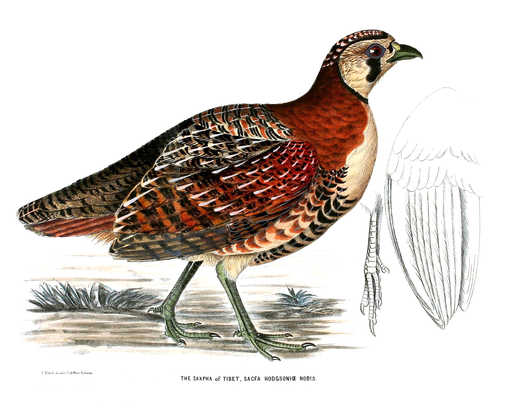

**Purpose**: This page describes how SNPs were used to build species trees  and estimate divergence times within the genus *Perdix* with SNAPP.

**Procedure**: Filter a VCF file of SNP data

**Input**: a SNP VCF file

**Output**: a filtered VCF file & phylogeny with divergence estimates

[](https://en.wikipedia.org/wiki/Tibetan_partridge#/media/File:Sacpha_Hodgson.jpg)
Photo: Tibetan Partridge litograph by T. Black, artist possibly Rajman Singh :copyright: Public Domain


I am following a script from [Mikkelsen et al. 20XX](), who based it on a [tutorial](https://github.com/elsemikk/tutorials/blob/master/divergence_time_estimation/README.md)

## Programs

ruby path

`/opt/microsoft/omsagent/ruby/bin/ruby`

snapp_prep path
`/home/wdavis34/Tools/snapp_prep-master/snapp_prep.rb`

beast path
`/scratch/wdavis/Tools/beast/bin`

## Dataset
Starting with previously made SNP dataset.
VCF file contains 29 individuals and has been filtered for:
*depth of coverage
*quality (100)
*mapping quality (10)
*no indels
*Only biallelic SNPs

This file is kept in

`/output/Partridge_project/VCF/29.Partridge.birds.v2.snp.filtered.Q100.GQ10.recode.vcf`

SNAPP does not handle missing data; therefore, it must be removed. We also include flags to remove multiple alleles, just in case.

```bash
#remove missing data and any multiallelics/invariants

time /home/sangeet/UserDirectories/Sangeet/Tools/vcftools_0.1.13/bin/vcftools --vcf /output/Partridge_project/VCF/29.Partridge.birds.v2.snp.filtered.Q100.GQ10.recode.vcf --out /scratch/wdavis/Partiridge_project/VCF/29.Partridge.birds.v3.snp.filtered.biallelic --max-missing 1.0 --min-alleles 2 --max-alleles 2 --recode

#time reports the amount of time the process took to run so that one can plan for the future

#reduce linkage
#Sangeet says not to do this unless necessary for SNAPP to run; I ran it anyway just in case we do need it later.
screen
time /home/sangeet/UserDirectories/Sangeet/Tools/vcftools_0.1.13/bin/vcftools --vcf /scratch/wdavis/Partiridge_project/VCF/29.Partridge.birds.v3.snp.filtered.biallelic.recode.vcf --out /scratch/wdavis/Partiridge_project/VCF/29.Partridge.birds.v4.snp.filtered.5kthinned --thin 5000 --recode
#ctrl + Z
bg
screen -d
```
remote detached from 16856.pts-9.slamichh

Filtering for multiallelic and missing data

>After filtering, kept 29 out of 29 Individuals
>Outputting VCF file...
>After filtering, kept 15105229 out of a possible 23846412 Sites
>Run Time = 2259.00 seconds
>real    37m39.195s
>user    36m38.611s
>sys     0m59.661s

Filtering for linkage:

>After filtering, kept 29 out of 29 Individuals
>Outputting VCF file...
>After filtering, kept 190689 out of a possible 15105229 Sites
>Run Time = 98.00 seconds


## Prepare Inputs

In order to run SNAPP, we first need to create input files.

Use [snapp_prep.rb](https://github.com/mmatschiner/snapp_prep).

To start, we need a list of samples.

```bash
#generated a list from the vcf file
cat 29.Partridge.birds.v3.snp.filtered.biallelic.recode.vcf | grep -v "##" | head -n 1 | tr "\t" "\n" >samples.txt
#Used vi to delete the unneeded column names
#added a tab at the front of each line
cat samples.txt | sed 's/^/\t/g' > samples2.txt
#used vi to put in column names and add the first column
#deleted first file and renamed the second file
rm samples.txt
mv samples2.txt samples.txt
```

Finished product

```
species specimen
D1909645A       10_D1909645A-QJ/24.89
D1909646A       11_D1909646A-LJ/20.15
D1909647A       12_D1909647A-LJ/27.27
D1909648A       13_D1909648A-LJ/22.66
D1909649A       14_D1909649A-LJ
D1909650A       15_D1909650A-LJ/25.19
D1909651A       16_D1909651A-LJ/22.54
D1910495A       17_D1910495A-XZ/23.01
D1910496A       18_D1910496A-XZ/29.65
D1909654A       19_D1909654A-LJ
D1909636A       1_D1909636A-QJ
D1910498A       20_D1910498A-XZ/26.48
D1910499A       21_D1910499A-XZ
D1909657A       22_D1909657A-LJ/21.04
D1910501A       23_D1910501A-XZ/24.62
D1910502A       24_D1910502A-XZ/25.04
D1910503A       25_D1910503A-XZ
D1909637A       2_D1909637A-QJ/24.86
D1909638A       3_D1909638A-QJ/22.14
D1909639A       4_D1909639A-QJ
D1909640A       5_D1909640A-QJ/27.08
D1909641A       6_D1909641A-QJ/25.06
D1909642A       7_D1909642A-QJ/24.24
D1909643A       8_D1909643A-QJ
D1909644A       9_D1909644A-QJ/24.65
A       A
B       B
C       C
D       D
```

Next, we need an estimate of divergence date to use as a constraint on the tree.

[Bao et al. 2010](https://doi.org/10.1016/j.ympev.2010.03.038) used "an internal fossil-based anchor point to estimate divergence times within *Perdix*. The earliest known fossil record of Daurian [*Perdix dauurica*] is approximately 2.0 million years old from Chou-kou-tien in northeastern China (Hou 1982)." They set the minimum divergence for *Perdix dauurica* and *Perdix perdix* to 2.0 myr (95%HPD: 1.67-2.33 myr).Based on their analysis, they estimated that *Perdix* is 3.63 mya (95%HPD: 1.71-7.01 mya), which aligns with the beginning of the uplifting of the Tibetan Plateau, also known as the Qingzang Movement. This occurred as 3 phases: 3.4 mya, 2.5 mya, and 1.7 mya. Based on that, I would predict that *P. perdix* + *P. dauurica* is at least 2.5 mya.

[Time tree](http://www.timetree.org/) estimates that *Perdix* is 4.37 mya (2.65 - 6.08 mya) and that the *P. perdix* + *P. dauurica* 
clade is 2.8 mya (1.67 - 3.94 mya). 

I think I will try a few options:

1. First, we will do a run setting the age of *P. dauurica* to 2 mya.
2. Then we will do a run setting the age of the whole genus to 3.63 mya.
3. Then we will do a run setting the age of the whole genus to 4.37 mya.
4. Last, we will fo a run setting the age of *P. perdix* + *P. dauurica* to 2.8 mya.

Thus, we will set up 4 constraint files.

constraints1.txt

```
lognormal(0,2.0,0.005) stem D1910499A,D1909657A,D1910501A,D1910502A,D1910503A
```

constraints2.txt

```
lognormal(0,3.63,0.005) crown D1909645A,D1909646A,D1909647A,D1909648A,D1909649A,D1909650A,D1909651A,D1910495A,D1910496A,D1909654A,D1909636A,D1910498A,D1910499A,D1909657A,D1910501A,D1910502A,D1910503A,D1909637A,D1909638A,D1909639A,D1909640A,D1909641A,D1909642A,D1909643A,D1909644A,A,B,C,D
```

constraints3.txt

```
lognormal(0,4.37,0.005) crown D1909645A,D1909646A,D1909647A,D1909648A,D1909649A,D1909650A,D1909651A,D1910495A,D1910496A,D1909654A,D1909636A,D1910498A,D1910499A,D1909657A,D1910501A,D1910502A,D1910503A,D1909637A,D1909638A,D1909639A,D1909640A,D1909641A,D1909642A,D1909643A,D1909644A,A,B,C,D
```

constraints4.txt

```
lognormal(0,2.8,0.005) stem D1910499A,D1909657A,D1910501A,D1910502A,D1910503A,D1909651A,D1910495A,D1910496A,D1909654A,D1910498A
```

As per [Mikkelsen et al. 20XX](), the standard deviation is not in real space. Thus, based on their results, we set it to 0.005 in all cases.

Now the input files can be created using [snapp_prep.rb](https://github.com/mmatschiner/snapp_prep).

Mikkelsen et al. 20XX used 20,000,000 generations in their final analysis. I am only going to use 500,000 for the initial runs. That way it takes less time, but I can see results and judge what constraint is the best.

Run 1

```bash
screen
time /opt/microsoft/omsagent/ruby/bin/ruby /home/wdavis34/Tools/snapp_prep-master/snapp_prep.rb -v /scratch/wdavis/Partiridge_project/VCF/29.Partridge.birds.v3.snp.filtered.biallelic.recode.vcf -t samples.txt -c constraints1.txt -l 500000
#ctrl + Z
screen -d
```

Screen: 14958

The above did not work, in so much as it did not produce output. Trying below.

```bash
screen
time /opt/microsoft/omsagent/ruby/bin/ruby /home/wdavis34/Tools/snapp_prep-master/snapp_prep.rb -v /scratch/wdavis/Partiridge_project/VCF/29.Partridge.birds.v3.snp.filtered.biallelic.recode.vcf -t samples.txt -c constraints1.txt -l 500 -x /scratch/wdavis/Partiridge_project/SNAPP/run_1/snapp_run1.xml &
screen -d 
```

Screen: 5417

The above worked! Thus, I must specify the output file in order to avoid permission errors! Took forever to run though....

Going to re-run with 500,000 iterations.

```bash
screen
time /opt/microsoft/omsagent/ruby/bin/ruby /home/wdavis34/Tools/snapp_prep-master/snapp_prep.rb -v /scratch/wdavis/Partiridge_project/VCF/29.Partridge.birds.v3.snp.filtered.biallelic.recode.vcf -t samples.txt -c constraints1.txt -l 500000 -x /scratch/wdavis/Partiridge_project/SNAPP/run_1/snapp_run1.xml &
screen -d 
```
Screen: 16441

Output

```bash
WARNING: Excluded 165 monomorphic sites.

INFO: Retained 15105064 bi-allelic sites.

WARNING: As no starting tree has been specified, a random starting tree will be used by
    SNAPP. If the random starting tree is in conflict with specified constraints, SNAPP
    may not be able to find a suitable state to initiate the MCMC chain. This will lead
    to an error message such as 'Could not find a proper state to initialise'. If such
    a problem is encountered, it can be solved by providing a starting tree in which
    the ages of constrained clades agree with the constraints placed on these clades.

Wrote SNAPP input in XML format to file /scratch/wdavis/Partiridge_project/SNAPP/run_1/snapp_run1.xml.


real    188m45.558s
user    185m32.280s
sys     3m11.531s
```

Beast Run 1 did not work (see error message below). So, changed "A" to "Bird_A" in the samples file and tried again.

```bash
screen
time /opt/microsoft/omsagent/ruby/bin/ruby /home/wdavis34/Tools/snapp_prep-master/snapp_prep.rb -v /scratch/wdavis/Partiridge_project/VCF/29.Partridge.birds.v3.snp.filtered.biallelic.recode.vcf -t samples2.txt -c constraints1.txt -l 100 -x /scratch/wdavis/Partiridge_project/SNAPP/run_1/snapp_run1_100it_birdA.xml &
screen -d 
```

PI: 13155
Screen: 25815

Output:

```bash
WARNING: Excluded 165 monomorphic sites.

INFO: Retained 15105064 bi-allelic sites.

WARNING: As no starting tree has been specified, a random starting tree will be used by
    SNAPP. If the random starting tree is in conflict with specified constraints, SNAPP
    may not be able to find a suitable state to initiate the MCMC chain. This will lead
    to an error message such as 'Could not find a proper state to initialise'. If such
    a problem is encountered, it can be solved by providing a starting tree in which
    the ages of constrained clades agree with the constraints placed on these clades.

Wrote SNAPP input in XML format to file /scratch/wdavis/Partiridge_project/SNAPP/run_1/snapp_run1_100it_birdA.xml.


real    185m52.805s
user    182m29.804s
sys     3m22.299s
```

Ok, re-running xml file with new samples.txt and 500,000 generations.

```bash
screen
time /opt/microsoft/omsagent/ruby/bin/ruby /home/wdavis34/Tools/snapp_prep-master/snapp_prep.rb -v /scratch/wdavis/Partiridge_project/VCF/29.Partridge.birds.v3.snp.filtered.biallelic.recode.vcf -t samples.txt -c constraints1.txt -l 500000 -x /scratch/wdavis/Partiridge_project/SNAPP/run_1/snapp_run1.xml &
screen -d 
```

PID: 6190
Screen: 5887


Run 2

```bash
screen
time /opt/microsoft/omsagent/ruby/bin/ruby /home/wdavis34/Tools/snapp_prep-master/snapp_prep.rb -v ../VCF/29.Partridge.birds.v3.snp.filtered.biallelic.recode.vcf -t samples.txt -c constraints2.txt -l 100000
#This creates a quick and dirty tree. A better tree sets -l to 500000
#ctrl + Z
screen -d
```
Screen: 32402

Above did not work. Trying again designating the output.

```bash
screen
time /opt/microsoft/omsagent/ruby/bin/ruby /home/wdavis34/Tools/snapp_prep-master/snapp_prep.rb -v /scratch/wdavis/Partiridge_project/VCF/29.Partridge.birds.v3.snp.filtered.biallelic.recode.vcf -t samples.txt -c constraints2.txt -l 500000 -x /scratch/wdavis/Partiridge_project/SNAPP/run_2/snapp_run2.xml &
screen -d 
```

Screen: 26454

Output

```bash
WARNING: Excluded 165 monomorphic sites.

INFO: Retained 15105064 bi-allelic sites.

WARNING: As no starting tree has been specified, a random starting tree will be used by
    SNAPP. If the random starting tree is in conflict with specified constraints, SNAPP
    may not be able to find a suitable state to initiate the MCMC chain. This will lead
    to an error message such as 'Could not find a proper state to initialise'. If such
    a problem is encountered, it can be solved by providing a starting tree in which
    the ages of constrained clades agree with the constraints placed on these clades.

ERROR: Expected three character strings per line for each constraint specification, but found
    'lognormal(0,3.63, 0.005) crown D1909645A,D1909646A,D1909647A,D1909648A,D1909649A,D1909650A,D1909651A,D1910495A,D1910496A,D1909654A,D1909636A,D1910498A,D1910499A,D1909657A,D1910501A,D1910502A,D1910503A,D1909637A,D1909638A,D1909639A,D1909640A,D1909641A,D1909642A,D1909643A,D1909644A,A,B,C,D',

real    218m17.007s
user    213m38.757s
sys     4m37.066s
```

Not sure what the error is. No xml file was created. Since run 3 worked and they have the same constraint list just different times, copied it into the run_2 folder and used vi to edit the times.

```bash
screen
time /opt/microsoft/omsagent/ruby/bin/ruby /home/wdavis34/Tools/snapp_prep-master/snapp_prep.rb -v /scratch/wdavis/Partiridge_project/VCF/29.Partridge.birds.v3.snp.filtered.biallelic.recode.vcf -t samples.txt -c constraints2.txt -l 500000 -x /scratch/wdavis/Partiridge_project/SNAPP/run_2/snapp_run2.xml &
screen -d 
```

Screen: 10674

Killed until I can figure out the beast error message.


Run 3

```bash
screen
time /opt/microsoft/omsagent/ruby/bin/ruby /home/wdavis34/Tools/snapp_prep-master/snapp_prep.rb -v /scratch/wdavis/Partiridge_project/VCF/29.Partridge.birds.v3.snp.filtered.biallelic.recode.vcf -t samples.txt -c constraints3.txt -l 500000
#ctrl + Z
screen -d
```

Screen: 15870

Above did not work. Trying again designating the output.

```bash
screen
time /opt/microsoft/omsagent/ruby/bin/ruby /home/wdavis34/Tools/snapp_prep-master/snapp_prep.rb -v /scratch/wdavis/Partiridge_project/VCF/29.Partridge.birds.v3.snp.filtered.biallelic.recode.vcf -t samples.txt -c constraints3.txt -l 500000 -x /scratch/wdavis/Partiridge_project/SNAPP/run_3/snapp_run3.xml &
screen -d 
```

remote detached from 6863.pts-9.slamichh

output

```bash
 WARNING: Excluded 165 monomorphic sites.

INFO: Retained 15105064 bi-allelic sites.

WARNING: As no starting tree has been specified, a random starting tree will be used by
    SNAPP. If the random starting tree is in conflict with specified constraints, SNAPP
    may not be able to find a suitable state to initiate the MCMC chain. This will lead
    to an error message such as 'Could not find a proper state to initialise'. If such
    a problem is encountered, it can be solved by providing a starting tree in which
    the ages of constrained clades agree with the constraints placed on these clades.

Wrote SNAPP input in XML format to file /scratch/wdavis/Partiridge_project/SNAPP/run_3/snapp_run3.xml.


real    197m9.853s
user    194m16.035s
sys     2m53.239s
```


Run 4

```bash
screen
time /opt/microsoft/omsagent/ruby/bin/ruby /home/wdavis34/Tools/snapp_prep-master/snapp_prep.rb -v /scratch/wdavis/Partiridge_project/VCF/29.Partridge.birds.v3.snp.filtered.biallelic.recode.vcf -t samples.txt -c constraints4.txt -l 500000 &
screen -d
```

Screen: 16328

Above did not work. Trying again designating the output.

```bash
screen
time /opt/microsoft/omsagent/ruby/bin/ruby /home/wdavis34/Tools/snapp_prep-master/snapp_prep.rb -v /scratch/wdavis/Partiridge_project/VCF/29.Partridge.birds.v3.snp.filtered.biallelic.recode.vcf -t samples.txt -c constraints4.txt -l 500000 -x /scratch/wdavis/Partiridge_project/SNAPP/run_4/snapp_run4.xml &
screen -d 
```

Screen:  13769

output

```bash
WARNING: Excluded 165 monomorphic sites.

INFO: Retained 15105064 bi-allelic sites.

WARNING: As no starting tree has been specified, a random starting tree will be used by
    SNAPP. If the random starting tree is in conflict with specified constraints, SNAPP
    may not be able to find a suitable state to initiate the MCMC chain. This will lead
    to an error message such as 'Could not find a proper state to initialise'. If such
    a problem is encountered, it can be solved by providing a starting tree in which
    the ages of constrained clades agree with the constraints placed on these clades.

Wrote SNAPP input in XML format to file /scratch/wdavis/Partiridge_project/SNAPP/run_4/snapp_run4.xml.


real    206m28.246s
user    203m11.119s
sys     3m16.468s
```


## Beast Mode

Run 1

```bash
screen
/home/wdavis34/Tools/beast/bin/beast -threads 12 snapp_run1.xml &
```

output

```bash
Random number seed: 1620662467542

File: snapp_run1.xml seed: 1620662467542 threads: 12
Loading package SNAPP v1.5.1
Loading package BEAST v2.6.3
Loading package BEAST v2.6.3

Error 104 parsing the xml input file

IDs should be unique. Duplicate id 'A' found

Error detected about here:
  <beast>
      <run id='mcmc' spec='MCMC'>
          <state id='state'>
              <stateNode id='tree' spec='beast.util.ClusterTree'>
                  <taxa id='data' spec='snap.Data'>
                      <taxonset id='A' spec='TaxonSet'>
                          <taxon id='A' spec='Taxon'>
```

Error meesage must mean it doesn't like the taxon name "A". Because "A" is used to refer to the taxonset?

First thing to try is to change "A" to "Bird_A" in the samples file.

Trying again with new xml file.

```bash
screen
/home/wdavis34/Tools/beast/bin/beast -threads 12 snapp_run1_100it_birdA.xml &
```

PID: 25989

New error:

```bash
java.lang.reflect.InvocationTargetException
        at java.base/jdk.internal.reflect.NativeMethodAccessorImpl.invoke0(Native Method)
        at java.base/jdk.internal.reflect.NativeMethodAccessorImpl.invoke(NativeMethodAccessorImpl.java:62)
        at java.base/jdk.internal.reflect.DelegatingMethodAccessorImpl.invoke(DelegatingMethodAccessorImpl.java:43)
        at java.base/java.lang.reflect.Method.invoke(Method.java:564)
        at beast.app.beastapp.BeastLauncher.run(Unknown Source)
        at beast.app.beastapp.BeastLauncher.main(Unknown Source)
Caused by: java.lang.OutOfMemoryError: Java heap space
        at beast.evolution.alignment.Alignment.calcPatterns(Unknown Source)
        at beast.evolution.alignment.Alignment.sanityCheckCalcPatternsSetUpAscertainment(Unknown Source)
        at beast.evolution.alignment.Alignment.initializeWithSequenceList(Unknown Source)
        at beast.evolution.alignment.Alignment.initAndValidate(Unknown Source)
        at snap.Data.initAndValidate(Unknown Source)
        at beast.util.XMLParser.initBEASTObjects(Unknown Source)
        at beast.util.XMLParser.parse(Unknown Source)
        at beast.util.XMLParser.parseFile(Unknown Source)
        at beast.app.BeastMCMC.parseArgs(Unknown Source)
        at beast.app.beastapp.BeastMain.main(Unknown Source)
        ... 6 more
```
